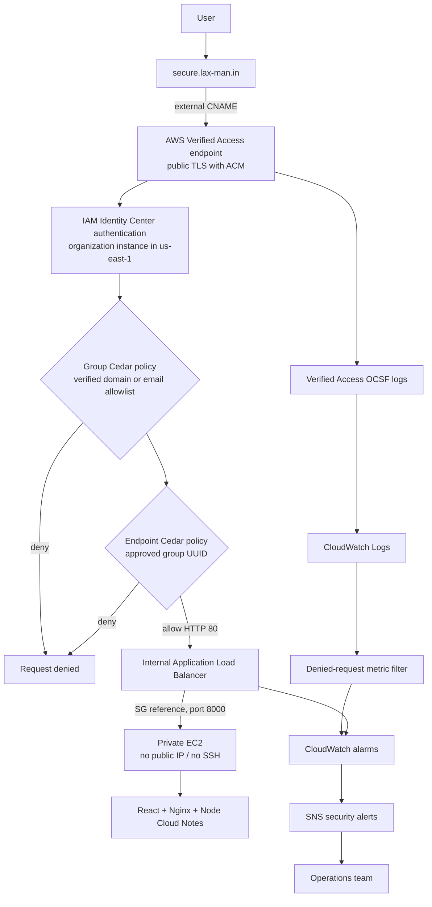

# Architecture

Two public and two private subnets span two Availability Zones. “Public subnet” means it has an Internet Gateway route; no application component is placed there except the optional NAT gateway. The internal ALB, Verified Access endpoint attachments, and EC2 instance use private subnets.

Traffic is constrained by three security groups: Verified Access may egress only to the ALB on 80; the ALB accepts only that source and may egress only to the app on 8000; EC2 accepts 8000 only from the ALB. EC2 has outbound 80/443 and VPC DNS solely for bootstrap, SSM, and container retrieval.

One NAT gateway is the default cost/operability compromise. It enables patching and public container-image pulls without exposing EC2. A production HA deployment would use a NAT per AZ; a lower-recurring-cost hardened deployment would use a pre-baked AMI, private ECR, S3 gateway endpoint, and regional interface endpoints before disabling NAT.
