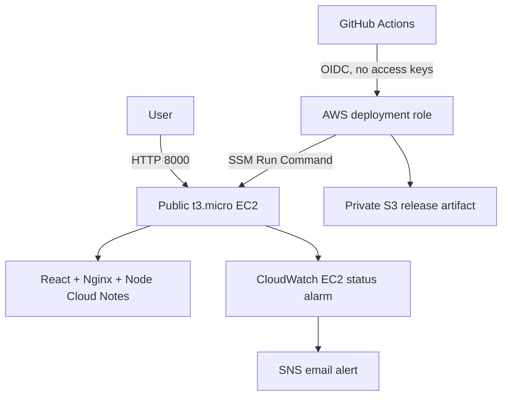

# Architecture

The default is a cost-controlled learning profile.

The VPC and Internet Gateway have no hourly charge. The application instance is placed in a public subnet and receives one public IPv4 address so it can reach SSM, package repositories, and container registries without a NAT Gateway. The security group exposes only application port `8000`; SSH is closed. EC2 detailed monitoring is disabled, the encrypted `gp3` root volume is 12 GiB, and CI artifacts expire after seven days.

`free_tier_mode = true` prevents the default path from creating the major hourly-cost components: NAT Gateway, Application Load Balancer, ACM certificate, and Verified Access. The production modules remain in the repository for a later cost-approved exercise.

## Security trade-off

The Free Tier URL is public HTTP and does not authenticate the configured email allowlist. Those emails are retained for the later IAM Identity Center and Verified Access phase. Do not store sensitive notes in learning mode. A production deployment should restore private EC2, TLS, ALB, and identity-aware access only after reviewing their recurring cost.
